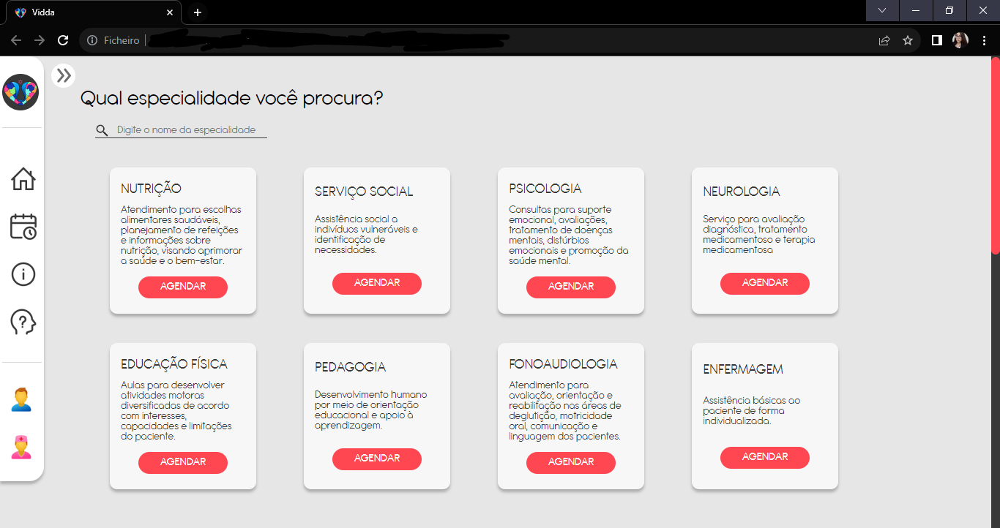

# VIDDA - ANAGRAMA DE DAVID
Ferramenta de agendamento online especialmente designada para atender às necessidades das crianças com Transtorno do Espectro Autista (TEA) na região de Atibaia, que buscam serviços na Casa de David, uma instituição filantrópica com mais de seis décadas de dedicação ao atendimento gratuito. 

<h3>Lista de especialidades oferecidas:</h3>
<ol>
  <li>Nutrição</li>
  <li>Fonoaudiologia</li>
  <li>Pedagogia</li>
  <li>Educação física</li>
  <li>Psicologia</li>
  <li>Psiquiatria</li>
  <li>Serviço social</li>
  <li>Enfermagem</li>
</ol>

## Objetivos
Facilitar a rotina de trabalho dos colaboradores da instituição com a implantação de um sistema de agendamentos de consultas diárias em que o cronograma de trabalho dos profissionais da área da saúde poderá ser organizado, podendo oferecer uma maior praticidade nos atendimentos.

<h2>Recursos utilizados:</h2>
<li>brModelo</li>
<li>Visual Studio Code</li>
<li>XAMPP</li>
<li>Figma</li>
<li>Insomnia</li>

<h2>Linguagens utilizadas:</h2>
<li>SQL</li>
<li>PHP</li>
<li>JS</li>

## Equipe de Desenvolvimento
<h3>A equipe é composta por:</h3>

|  |           |            | 
| :---------------------------------------------------------------------:   | :--------------------------------------------------------------------------------: | :-------------------------------------------------------------------------------: | 
|                            Milleny Nogueira                               |                                Paulo Henrique Lopes                                |                                  Leonildo D Ribeiro                               |                          

 
 
Agradecemos o seu interesse em conhecer a Vidda :smiley:
